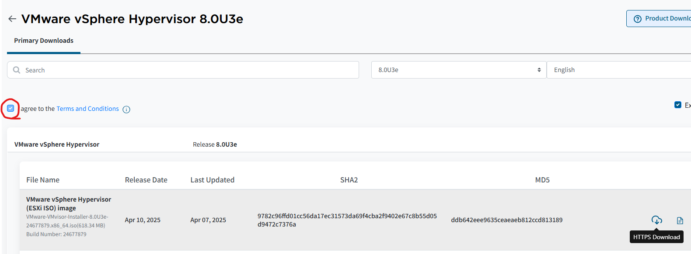
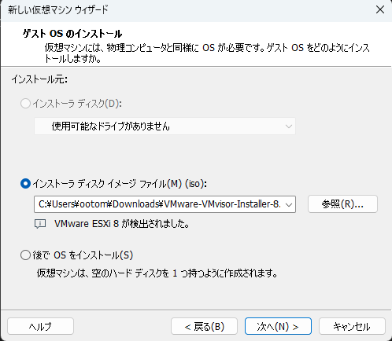
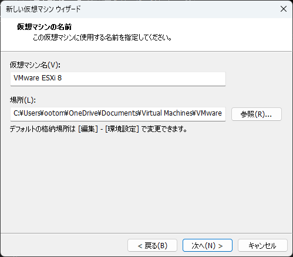

#　VMware WorkstationにESXiを入れておうちでもネットワークできるマンになりたい

## よういするもの
- VMware Workstation Proが入っているPC
- おおらかな心

## ISOを取りに行く
ここからISOを取りにいきます[(https://support.broadcom.com/group/ecx/productfiles?subFamily=VMware%20vSphere%20Hypervisor&displayGroup=VMware%20vSphere%20Hypervisor&release=8.0U3e&os=&servicePk=&language=EN&freeDownloads=true)](https://support.broadcom.com/group/ecx/productfiles?subFamily=VMware%20vSphere%20Hypervisor&displayGroup=VMware%20vSphere%20Hypervisor&release=8.0U3e&os=&servicePk=&language=EN&freeDownloads=true)

:::tip
`利用規約に同意`にチェックを入れた後、ダウンロードボタンが押せるようになります
:::

## 実際に入れてみる

- `インストーラディスクイメージファイル`に切り替え
- ダウンロードしてきたISOを通せば`VMware ESXi 8`が検出されるはず

### 仮想マシン名と場所

- 仮想マシン名はお好みで変更可能
- 保存場所はOneDrive配下になっているとOneDriveの仕様で大惨事になることが予想できるのでCドライブの直下にフォルダ作って保存しておくとよろし

### ディスク容量

