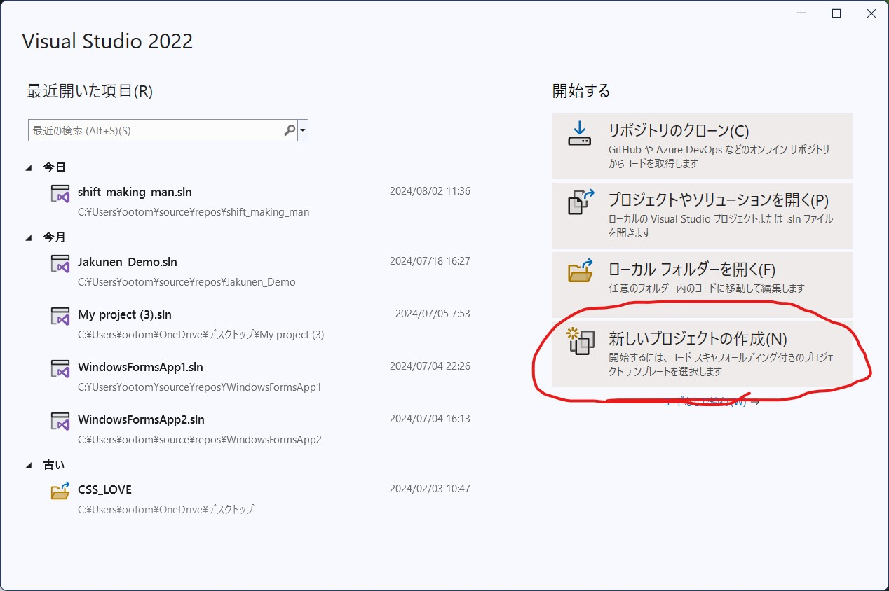
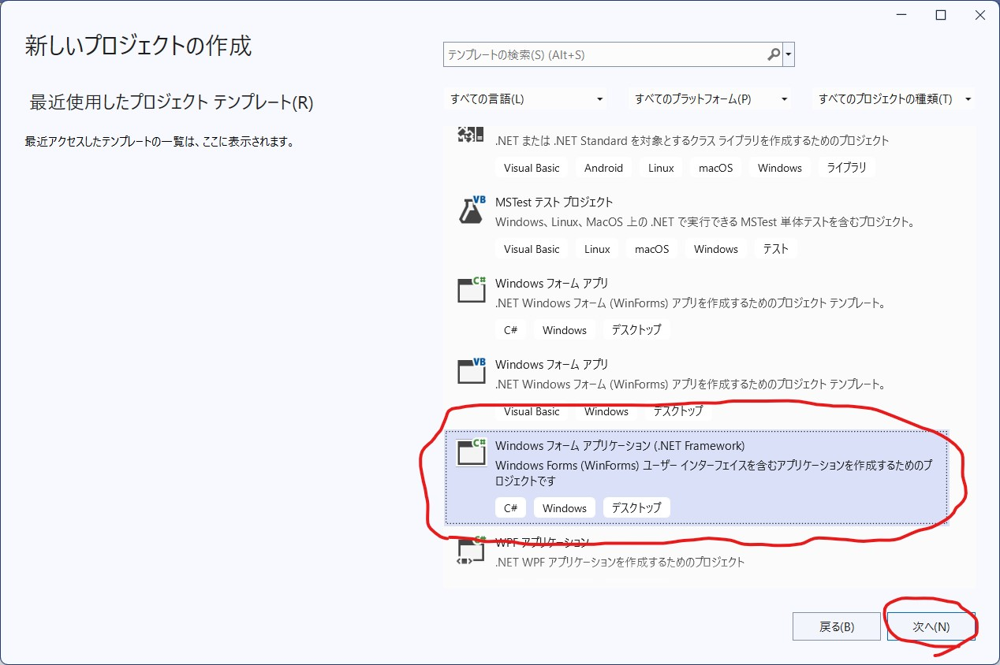
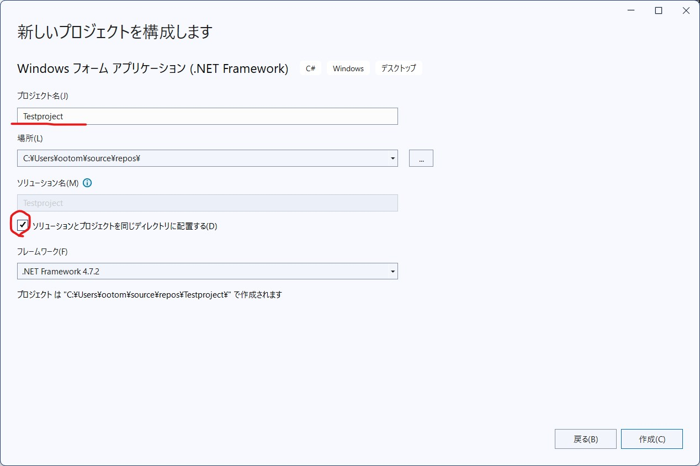

# VisualStudioで最低限使えるようにする
## プロジェクトの作成

新しいプロジェクトを作成をクリックしてください。

「Windowsフォームアプリケーション(.NET Framework)」というプロジェクトを選択し、次へを押します。

プロジェクト名にお好みのプロジェクト名を入れてください。最初の1文字目は英語大文字が望ましいです
そうしたら「ソリューションとプロジェクトを同じディレクトリに配置する」を選択してください。

:::info
プロジェクトの中に複数のソリューションを置くことができるのでこのように分けられていますが、正直無駄にフォルダマトリョーシカ化が加速するので推奨しません。
:::

