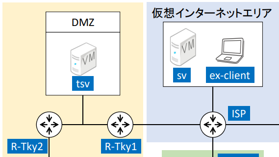

# ルーターの設定

## 要件


- tsv、R-Tky1、R-Tky2、ISPから構成
- R-Tky1とR-tky2の間にスイッチを配置してtsvを配置している

### ターミナル環境
- コマンド誤入力によるDNS検索をしない
- timezoneをJSTに
- more表示の無効化
- 表示割込みに対する入力文字列補完
- 特権モードで常にアクセス

### ホスト名
| ルーター名   | コンソールパスワード | イネーブルパスワード |
|-------------|---------------------|----------------------|
| R‐Tky1      | cisco               | cisco                |
| R‐Tky2      | cisco               | cisco                |
| R‐Gnm       | cisco               | cisco                |

### インターフェース設定


| ノード名   | インタフェース | IPv4アドレス         | IPv6アドレス               | 接続先ノード        |
| ------ | ------- | ---------------- | ---------------------- | ------------- |
| ISP    | Gi0/0   | 201.10.0.9/29    | 2001\:DB8:2:1::FF/64   | R-Tky1        |
| R-Tky1 | Gi0/0   | 201.10.0.14/29   | 2001\:DB8:2:1::1/64    | ISP           |
| R-Tky1 | Gi0/1   | 10.100.0.254/24  | 2001\:DB8:2:100::FF/64 | R-Tky2, tsv   |
| R-Tky2 | Gi0/0   | 10.100.0.1/24    | —                      | R-Tky1, tsv   |

### アクセス制御（IPv4）
- tsv からの発信トラフィックの戻りを許可
- tsv の DNS トラフィックを許可
- tsv の Web サービスへのトラフィックを許可
- tsv の SMTP トラフィックを許可
- R-Tky へのエコー要求を許可

### アクセス制御（IPv6）
- tsv からの発信トラフィックの戻りを許可
- tsv の DNS サービスへのトラフィックを許可
- tsv の Web サービスへのトラフィックを許可
- tsv へのエコー要求トラフィックを許可

:::info つまり何をすればいいんですか?
- tsvへ直接繋がってるルーターに各種サービスのトラフィック許可設定
- 10.100.から201.10.につなげないといけないのでNATの構築
:::

## コマンド
### 日本時間に合わせる
```bash
clock timezone JST +9
```

### ホストネームをルーターに合わせる
```bash
hostname "ここにホストネームを指定"
```

## 常にenabke
```bash
line console 0
privilege level 15
```

:::info
レベル15が所謂Admin権限
他のは知らぬ
:::

