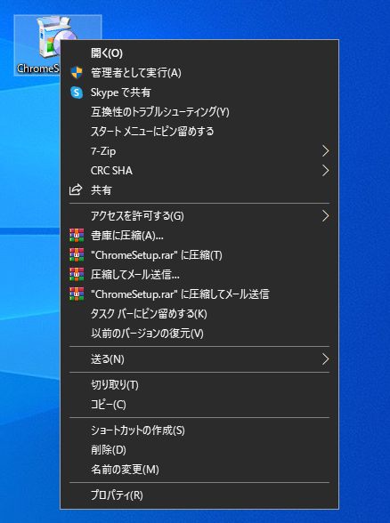
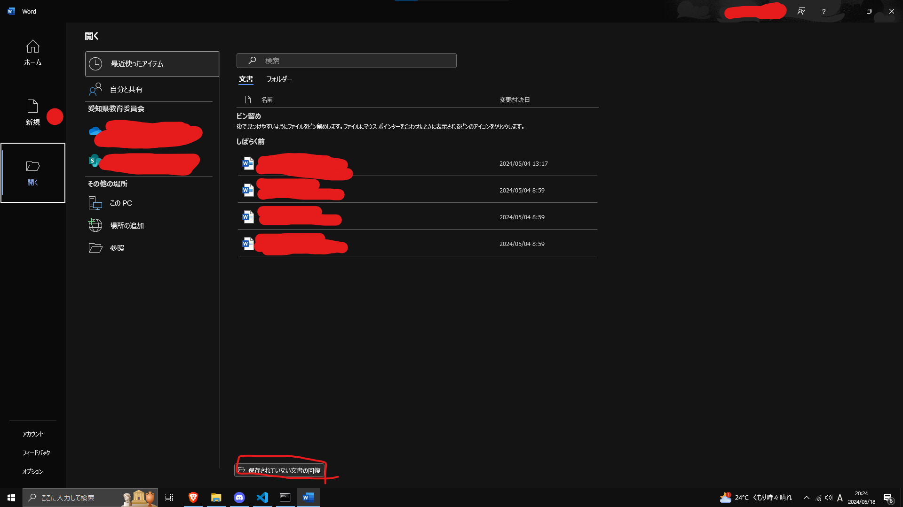

# パソコン系のよくある(?)問題について

初心者がやりがちなミスについてまとめました。

:::danger
何もしてないのに壊れることはありません。むやみに何もしてないのに壊れた！とかいうのはやめましょう。
また人に聞く前にいったん自分で調べましょう。それでもわからなければ人に聞きましょう。
:::

## 基礎編

### capslock・numlock

パスワードちゃんと打ってるのにログインできないって時は確認しましょう。capslockはshiftを押しながらその上のキーを押すことで解除できます。numlockはテンキー(電卓みたいなとこ)のnumlockというキーを押せば治ります。

### 充電してきたのにバッテリーがない

シャットダウンせずに画面だけ閉じてませんか？その状態だと少しづつバッテリー減りますよ？

### wifiがない
デスクトップの場合基本無線で接続できません。(全ノートPCが可能というわけではない。)無線LANカードか子機を買いましょう。
Bluetoothも同様です。

### 画面がつかない

バッテリーはちゃんとありますか？いったん充電端子を刺してみましょう。

### 水をぶっかけてしまった

運よく動いていてもぶっ壊れる可能性があるの作業中のデータだけ保存してすぐにシャットダウンして電源コードを抜きましょう。そしたら水分をふき取りしばらく乾燥させます。慌てて起動させてもしまだ水分が残っていた場合ショートして壊れる可能性があります。十分に乾燥させたら電源を入れ起動すればバックアップを取りましょう。何もわからなければ無理に解決しようとせず修理屋に頼みましょう。

### インストーラーをダウンロードして実行しても何も起こらない

パソコンでアプリをインストールするときはスマホと違ってワンタップではできません(一部を除く)基本的に規約の同意だったりショートカット作成のyes/noだったりインストール先だったりなどの設定をするウィンドウが出てきます。このウィンドウでいろいろチェックしたりして次へを繰り返すとインストールできます。

### アプリをインストールしようとしても失敗する

- 空き容量がない
- 管理者権限がない
- 既にインストール済み

失敗する場合大体上記の理由でインストールが失敗します

空き容量がない場合はdiskinfoなどで空きを作ってください。ゴミ箱にファイルがたまってたりするので見てみましょう。

管理者権限については学校配布タブレットはないのであきらめてください。自分のpcの場合インストーラーを右クリックし管理者として実行を押します。



既にインストールされていないか確認してみてください。再インストールしたい場合一度アンインストールしてからインストーラーを実行してみてください。

### ファイルが削除できない

そのファイルが何らかのプログラムが開いている場合ファイルの移動、削除、名前の変更ができません。一度そのファイルを開いているプログラムを閉じてから試してください。

### USBデバイスが認識されない

USBポートまたはデバイス自体が故障してる場合があります。違うポートに刺してみてください。またデバイスマネージャーからそのUSBデバイスを確認してみてください。

## 作業系

### 入力していくとどんどん文字が消えていく

insertキーを押せば治ります。一体このキー何に使うんですかね…

### 保存してないのにパソコンが落ちてしまった

Officeなどの一部のアプリは設定していれば自動保存でデータが残っている場合があります。

下のほうの四角で囲ったところから確認できます。

### 動作が遅い

一度にたくさんのプログラムを開きすぎている可能性があります。ctrl+shift+escでタスクマネージャーを起動してメモリ順にして不要ならプログラムを終了しましょう。もしくはメモリを増設しちゃいましょう。

### 一部キーボードが反応しない

キーに何かが詰まってたり壊れると一部キーが反応しなくなることがあります。メカニカルキーボードでキーを交換できるなら交換すると治ることがあります。

### コミットメッセージが空

日本語でもいいのでどこが変わっているのか書いておきましょう。空だとエラーが出ます。

### 古いバージョンをマージしてしまう

共同開発時に遅れているバージョンをマージしてしまうと変更が無になります。定期的にプルしておきましょう。

## Unity関連

### ファイル名などが日本語

エラーや文字化けの原因になります。絶対に日本語は使用しないでください。マジで後悔します。コメントアウトは大丈夫です。

### オブジェクトが紫色

アセットの名前変更、削除、移動をすると紐づけていたマテリアルなどが解除されて紫色になることがあります。元に戻してあげましょう。

### 急に真っ暗

初期から設置されているDirectionalLightを削除すると光源がなくなるので真っ暗になります。

### 光源があるのにオブジェクトが真っ黒

オブジェクトのTransformのスケール(大きさ)の一部が0や`-`になっていると真っ黒になります。そりゃ体積が0や`-`の物体っておかしいよね

### 物体をすり抜けてしまう。

衝突させるにはまず両方にコリジョンが必要です。リジットボディーは片方のみでも大丈夫です。

### プログラムを書いたのに全く動かない

書いたプログラムはきちんと正しいオブジェクトにアタッチしてありますか？アタッチしていないと何も起こりませんよ？

## あるあるエラー

### `;`がついていない

C言語ではコードの最後に`;`(セミコロン)を付ける必要があります。これのおかげで無理やりコードを一行に書いたりできます。

### 大文字小文字のミス

大文字と小文字の区別があります。よく見ましょう。

### `{}`の数が合っていない

`{}`はどこからどこまでがその処理なのかを示します。多すぎたり足りていないとエラーが出ます。Visual Studio君はかっこを選択するとその対応したかっこを教えてくれるので確認してみてください。

### スペースが全角になっている

プログラムは全角だと動きません。これはスペースに限らうず記号も同じです。

### 変数が宣言されていない

```C#
i = 10 + 5;
```

とか急にやられたらiはどこから来たの？ってエラーが出ます。

```C#
int i;
float a;
```

上のように最初に変数を宣言してから使いましょう。

### intなのに小数を使おうとしている

int型というのは整数のみを格納できます。なので1.5のような変数を入れてしまうとエラーが出ます。floatを使うかUnityのC#である場合次の記述をすることで少数を扱うことができます。

```C#
int i = 1.5f;
```
