# description: プロジェクトの編集

ここに掲載されている画像、撮影の順番がぐちゃぐちゃなので、後に作るものが先に映り込んでいたりします。

また画像が足りていません。

余計なものに惑わされないように気を付けて作業してください。ややこしくてごめんなさい。

## ゲームをつくっていく

皆さんお待ちかねのデモゲーム制作に入ります。

## 1.カメラの表示範囲をいじる(多分飛ばしてOK)

カメラの表示範囲を変更します。

左側にあるヒエラルキーウィンドウにあるMain Cameraをクリックすると、右側のウィンドウにMain Cameraのインスペクターが開きます。

そうしたらにある位置を(0, 0, -20)に、その下にあるCameraという項目にあるサイズを12に変更します。

この項目内の背景から背景色を変更できます。好きな色にしましょう。

## 2.壁を生やす

現在、ここには壁がありません。

このままではボールが跳ね返らずカメラの遥か彼方へ運動し続けてしまいます。

なので壁を作って当たり判定をつけて跳ね返るようにしなくてはなりません。

### 2-1.2Dオブジェクトを作る

ヒエラルキーを右クリックして、2Dオブジェクトから、四角形を選びます。

名前はわかりやすいようにwallとかにしましょう。

端のほうに配置しましょう。

ゲームタブで見るとどのようになっているかわかりやすいです

### 当たり判定を付ける

でもなんとこれで壁の完成ではありません。このままだとボール君は壁を認識できずやっぱり世界の彼方へ飛んで行ってしまいます。

というわけで、壁に当たり判定を付けてあげましょう。

さっき作った四角形をヒエラルキーから選ぶと、右にメニューが出てきます。

それの一番下にコンポーネントを追加というのがあるので、それを押しましょう。

上のほうに「Physics2D」があるので、これを選択。

上から2番目の「BoxCollider2D」を選択しましょう。

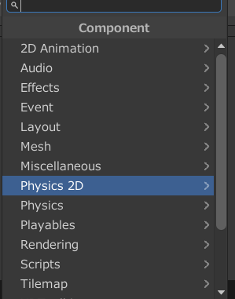

こんなのが出てきたら、当たり判定の実装が完了です。

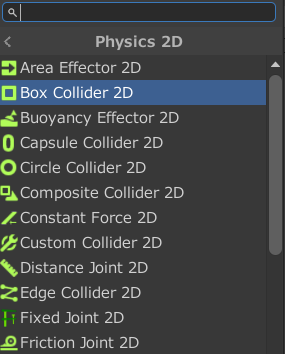

壁をいい感じに囲ってあげましょう。

## 3.プレイヤーを生み出す

### 3-1 オブジェクト生成

いよいよプレイヤーを作っていきます。急にゲームらしくなりますね。

まず、さっき壁を生やしたときのように四角形を生成します。名前はPlayerとかにしておきましょう。

当たり判定もつけたいので、ここもさっきと同じようにBoxCollider2Dをつけましょう。

### 3-2 スクリプトの作成

続いてはプレイヤーを動かすスクリプトを作っていきましょう。みんな大好きプログラミングのお時間です。

画面下のアセットを右クリックし、作成を選択します。そこからさらにC#スクリプトを選びます。

名前はPlayerControllerとかわかりやすくしておきましょう。

できたら作ったやつをダブルクリックします。VisualStudioが開けばOKです。

ひとまずこのように入力してください。それぞれの意味はこの後解説します。

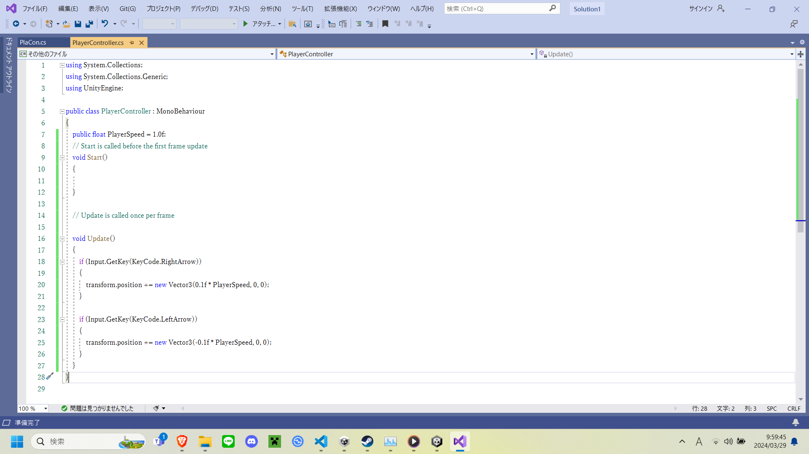

ここはUnityでコード書くぜ!ってやつです。

これからUnityでコード書くときはこれがあるか確認しましょう。(自動で書かれるから多分だいじょうぶ)

ここは変数です。この変数はスピードを管理してます。

publicってつけてると、Unity側でこの数値をいじくれるので便利です。(後述)

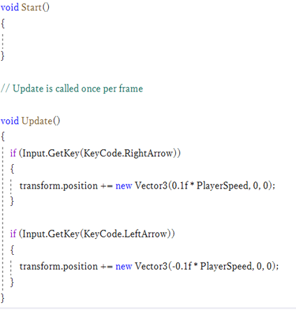

void startはゲームが始まったときに一回だけ実行する！ってやつです。

最初の変数の設定なんかはここで設定したりします。

void updateゲーム中ずっと繰り返し実行するぜ！ってやつです。ゲームの操作なんかはここに書きましょう。

ここは矢印キーの左右で移動できるようにするプログラムです。

### 3-3 スクリプトのアタッチ

いまのでスクリプトが完成しました。でもこれだと、プログラムは存在してはいますが使える状態にはありません。

というわけで、スクリプトをプレイヤーにアタッチしましょう。

Unityのエディターに戻りましょう。 そうしたら左のヒエラルキーから、Playerをクリックしましょう。

右に出たメニューに、さっき作ったスクリプトをドラッグ&ドロップしましょう。右メニューを一番下までスクロールしてからドラッグするとちょっとやりやすいかも。

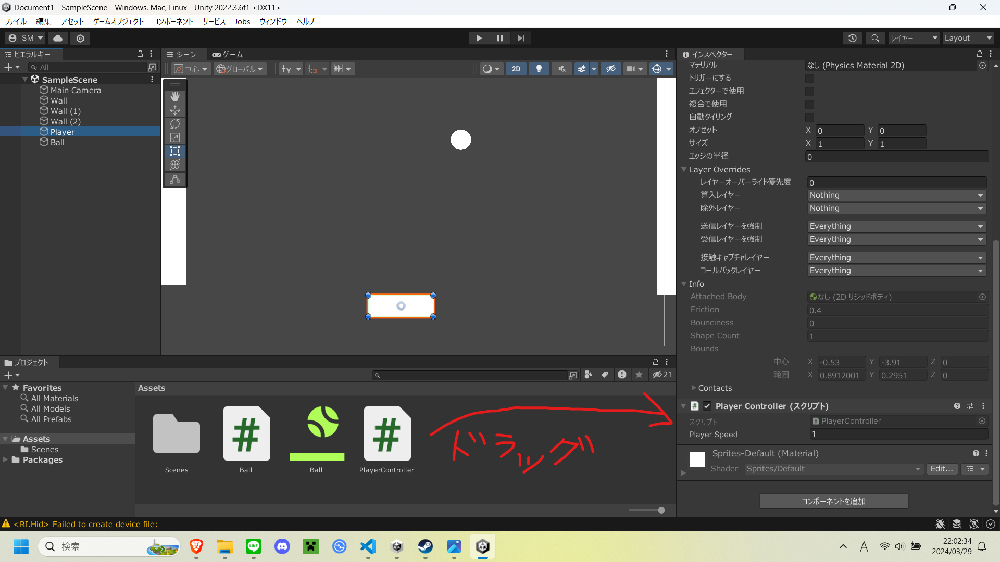

こんな感じになったら成功です。再生ボタンを押して左右矢印を押したら、Playerが動くと思います。

ちょっとゲームらしくなってきました。

## 4 ボール作成

### 4-1ボールの作成

ボールの作成編の一個目のタイトルがボールの作成ってややこしいですね。

さっき何回か四角形を作ったときのように、ヒエラルキーを右クリック→2Dオブジェクト→サークルを選択します。

名前はballとかにしておきましょう。

大きさはお好みで調整してください。

あんまりでかくしすぎてもあれだけど。

次に、当たり判定をつけましょう。今回はboxColliderじゃなくてCircleClider2Dを選びましょう。BoxColliderの下のほうにあるとおもいます。

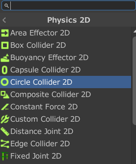

それから今回はもう一個つけるものがあります。

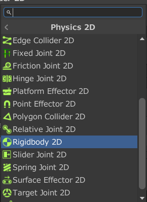

RigidBody2Dというやつです。こいつは物理を物に適用させることができます。

一回再生してみましょう。

物理が適用されているので落ちていってしまいましたね。

重力はいらないから消してしまいましょう。

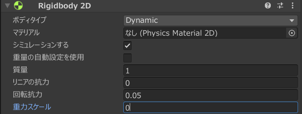

ここをいじると重力の強さを変えられます。

0にすれば無重力になるので0にしてあげましょう。
なんと今回はさらに作るものがございます。

### 4-2 ボールのスクリプト作成

次は、ボールに初速度を与えるプログラムを作っていきます。

さっきプレイヤーのスクリプトを作成したときと同じように、C#スクリプトを作成しましょう。

名前はballとかでいいと思います。

こちらがプログラム全体となります。

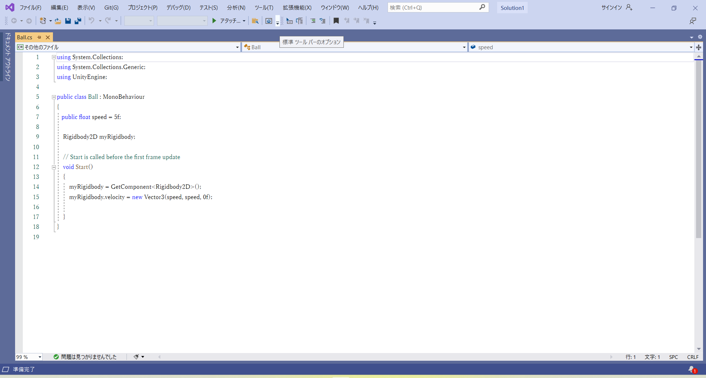

ここがボールのスピードを管理する変数です。さっき書いたようにここもpublicにしておくと便利です。

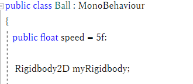

ここはボールに力を加えて動かすプログラムです。座標を変えるのではなく力を加えるなので、これで反射したりします。

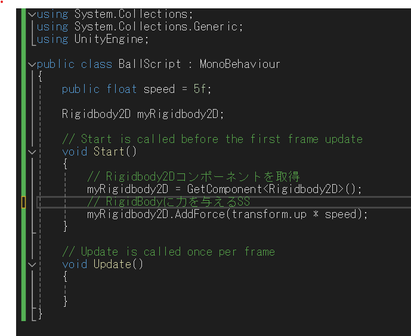

プログラムが完成したら、さっきPlayerにやったのと同じように、ballにスクリプトをアタッチしましょう。

再生ボタンを押してボールが動き始め、壁とかでバウンドしたら成功です。

## 5 ブロックの作成

### 5-1 ブロックのプレハブ作成

まずプレハブってなんぞや？って人もいらっしゃるでしょうから解説していきます。

プレハブっていうのは設計図みたいなものです。プログラムから何かものをいっぱい作りたいときとかに、このプレハブをもとに作ります。

今回はブロックをプレハブで作ります。

まずは四角形を作ります。好きな大きさでいいですがでかくないほうがいいでしょう。

これに当たり判定をつけましょう。もちろん今回もBoxColliderです。今まで通り入れましょう。

そしたら次、ヒエラルキーにあるブロックをアセットまでドラッグ&ドロップしましょう。

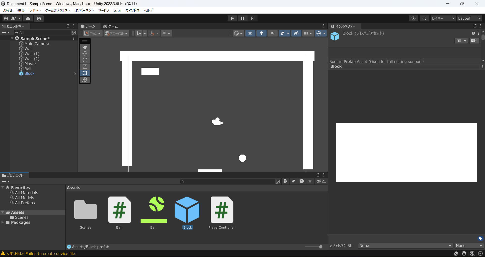
アセットにあるこれがプレハブです。

### 5-2 ブロックのスクリプト作成

続いてはブロックのスクリプトです。ボールが当たったら消えるっていうプログラムを作りましょう。

C#スクリプトを作成します。名前はBlockControllerとかでいいと思います。

今回作るプログラムは、ボールが当たったときにブロックを消滅させるプログラムです。

こちらがプログラム全体となります。この下の部分が、ボールが当たったときにブロックを消滅させるプログラムです。 このプログラム、結構流用できるので活用してくれるととてもうれしい。

### 5-3 スクリプトのアタッチ

さっき作ったスクリプトのアタッチをしましょう。

アセットからさっき作ったプレハブをクリックすると、右にこれが出てくると思います。ヒエラルキークリックしたときとよく似ていますね。

ここに、今までスクリプトをアタッチしたときのようにやってみましょう。プレハブにスクリプトをアタッチできるはずです。

### 5-4 ブロックの配置

プレハブをアセットからゲーム画面のエリアにもっていくと、そのまま配置することができます。

大体きれいに並ぶ感じでいっぱい並べましょう。一個ぐらい傾いてるやつがあっても面白いかも。 これが終わればほとんどメインは完成です。

## 6 ゲームオーバーの実装

### 6-1当たり判定の配置

いよいよ最後です。やっとこれが書き終わります。

まずは天井に使ってる壁をコピーして下にもっていきましょう。画面から見えないぐらいのとこに置いておきましょう。

つぎはこれに触れたときにゲームオーバーになる処理を作ります。

### 6-2ゲームオーバーの処理

ここの処理の説明がちょっとめんどくさいので、とりあえずコード見せます。

まずここを見てください。ここに見覚えのないやつありますよね。

ここはこの後つかうプログラムを使えるようにするやつです。忘れたらバグります。

何かが触れたときに、シーンを移行するプログラムです。シーンとかはあとで教えます。

### 6-3 シーン

ここまで書いててシーンの解説を完全に忘れてました。

シーンっていうのは、Unityのプログラム上の場面、画面を指すものです。

例えば今作業してるのがゲームシーンで、実際のゲームをする場所です。

今回は、ボールが下に行ったらもう一回ゲームシーンがよみこまれるようになっています。
