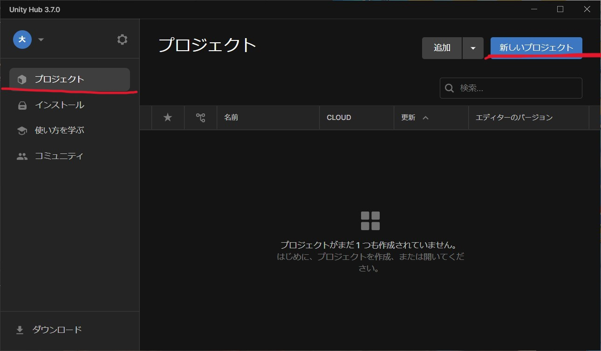
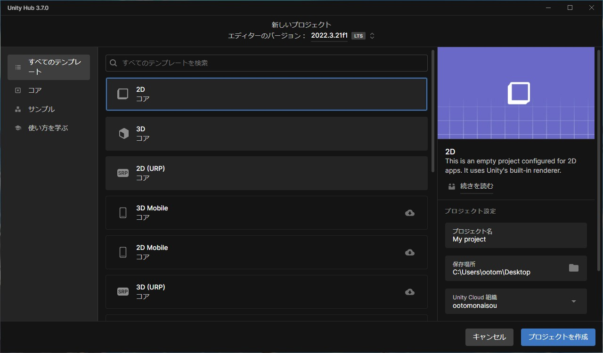
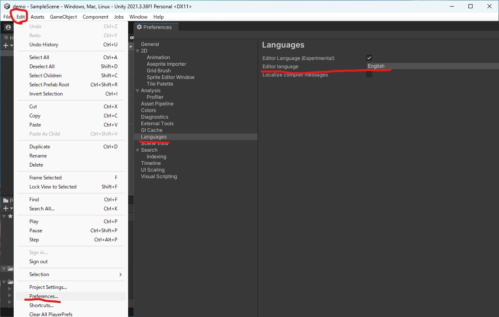

# プロジェクトを作成する

プロジェクトの作成方法の解説をします。といってもそこまで話すことはないです。Unityのインストール時点で日本語化されているならばちょちょいのちょいでできます。

## 1.プロジェクト作成

赤で囲ったプロジェクトをクリックして右上の青い新しいプロジェクトボタンををクリックしてください

プロジェクト名はdemoとか適当な名前を付けておいてください。また、保存先はGitのセットアップの時に作った場所を選択してください。

画像では切り替わっていませんが、Unityのバージョンは2021.3.24f1に切り替えておいてください。

注意点として2Dのゲームを作るときは2Dのプロジェクトを選ばないといけないという一見ちょろそうに見えて何気にミスをするポイントがあります。デフォルトでは3Dを選択してあるので脳死で作成を押すと、プロジェクトの作成には時間がかかるので結構待たされます。

## 2.Unityでプロジェクトを開けたら

日本語化されて開かれるはずですが、ごくまれになぜか日本語化されない現象に遭遇します。エディタの言語設定自体がテストされている機能なのでしょうがないです。

日本語化手順を解説しますがすでに日本語化されているアタリを引いた人は読み飛ばしてください。

EditからPreferencesを選択し、開いたウインドウでLanguagesをクリック、Editor languageの右にあるボックスをクリックすれば日本語を選択できるはずです。(日本語の選択肢部分はスクリーンショットが取れなかったためないですが、クリックするとドロップダウンリストが出てきて選択できるようになります)

また、正しく日本語のモジュールをインストールできていないと、Languageの項目が出てこないことがあるみたいです。

その場合、UnityHubのインストールという項目からエディターの歯車マークを押して出てくるモジュールを追加という項目を選択すれば、言語パックやその他OSのビルダーなどの初めてエディタをインストールするときに出てきた画面が表示されます。そこから日本語の言語パックをインストールしてください。

それでも出てこない場合はUnityだけ再インストールしてください。該当バージョンのUnityを歯車マークを押してエクスプローラーで表示を押してから、Windowsキーを押して、すべてのアプリを選択し、Unity(バージョン名)になっているファイルを探します。そのファイルの中にあるUnityという項目を右クリックし、アンインストールを選択します。そうするとWindowsの設定が開き、インストールされているアプリ一覧が出てきますので、そこから該当のUnityエディタを探し、右側にある三点リーダをクリックしてアンインストールを選択します。しばらく待つとアンインストールが終了するので、最初に開いたエクスプローラーの該当バージョンのエディターの構成ファイルを削除します。これをしないとUnityHubが永遠に認識してめんどくさいです。

Languageの項目が出てこなかった人で、自信がない人は部室にいるUnity班の先輩方に頼んでやってもらいましょう。2024年4月から2年になる業務用ITソフトウェアの班員である筆者もUnity班だったのでやれます。

追記:学校配布タブレットでやってる場合モジュールの追加ができないため日本語にできません。
わからない単語があればその辺に聞くなり調べるなりしてください。その分英語は身に付きますが面倒です。
親御さんに頼み込んでパソコンを買ってもらいましょう。
[機材について](https://)

## 3.コードエディタとしてVisual Studioを指定する

先ほど開いていた環境設定をひらいて、コードエディタとしてVisual Studioを指定します。

外部ツールから外部のスクリプトエディターをクリックしドロップダウンリストからVisual Studio 2022を指定します。

筆者が一度試しましたが、Unityエディタの再起動はしなくて大丈夫でした。設定が終わったら環境設定を閉じてください。