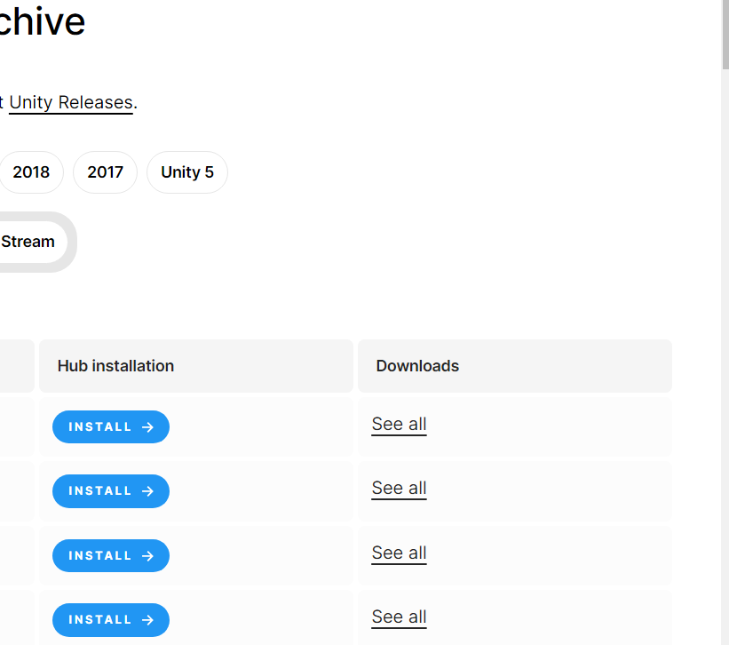
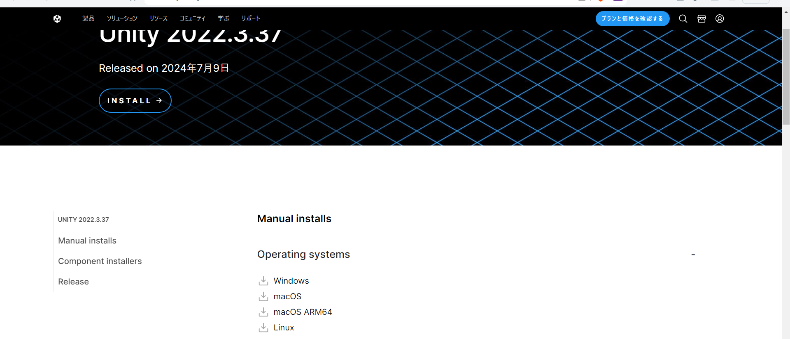
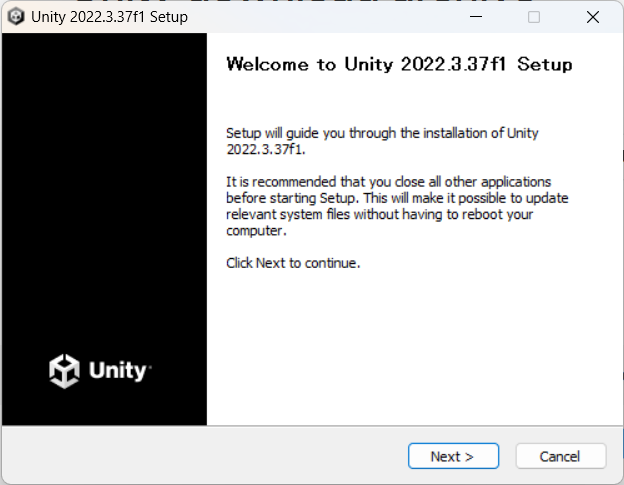
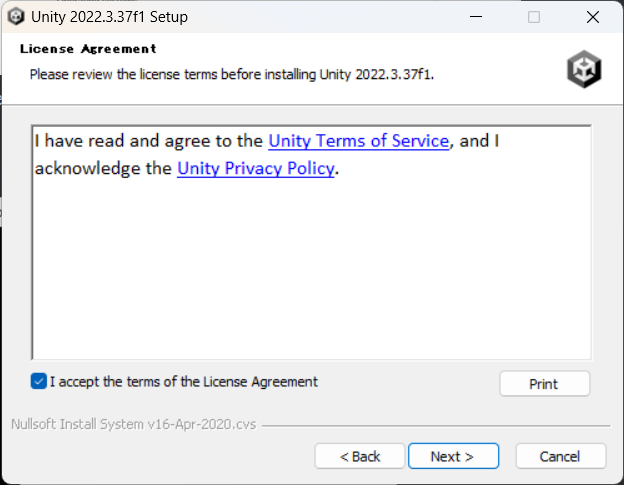
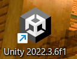

# 学校配布タブレットでUnityをインストールする方法

## はじめに

学校配布タブレットは謎のフィルターがあるので通常の方法ではインストールできません。
これにより日本語化やWEB GLビルドなどはできません。どうしても嫌なら自分のパソコンを用意して下さい。2万で十分動くパソコン買えます。なんならもっと安くも買えます。

## 方法

### インストーラーのダウンロード

https://unity.com/ja/releases/editor/archive
にアクセスしここからエディターDL　新しめのやつを選ぶ

Downloadsって書いてあるところのSeeAllを押す

Operating systemsの欄のWindowsを押す

ダウンロードしてexeファイルを開く

:::danger
パソコンのアプリケーションのインストールはスマホとは違いexeを実行すれば勝手にインストールされるということは基本ありません。
なので間違ってもインストールされないからと言ってexeファイルを連だーー！することがないようにしてください。
何も起こらないときは一度タスクバー(画面の下のアイコンがたくさんあるやつ)のUnityのアイコンがないか確認しそれでもなければ先輩に聞いてください。
:::

ねくすとをおす

下の方のチェックマーク押してネクスト

全部はいるまでネクスト

ダウンロード始まったら踊りながら待つ

インストールが終わると

デスクトップにこんな感じの黒いUnityが出るので押す

数字は画像と違っても気にしなくていい 

