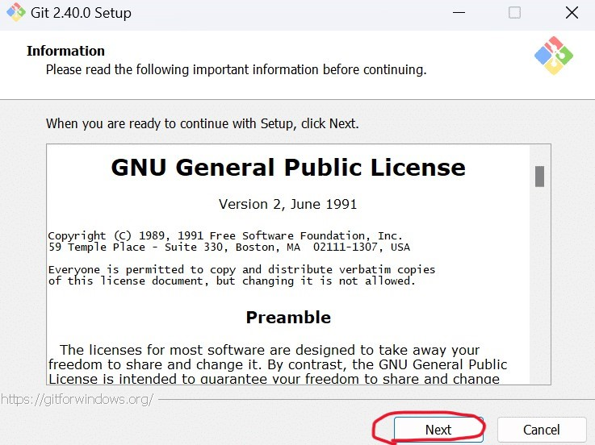
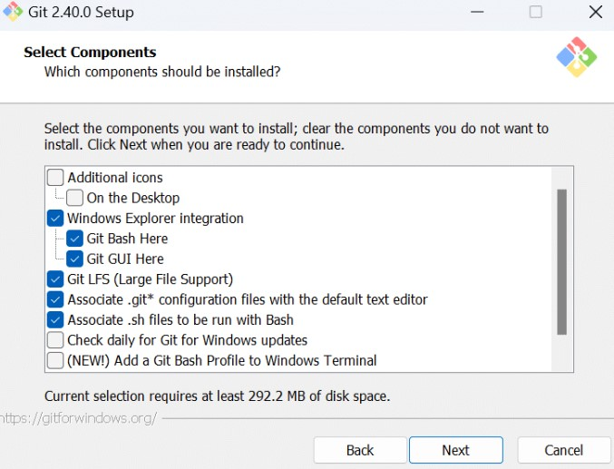
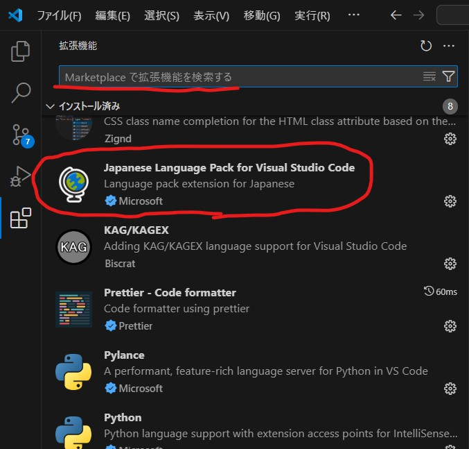
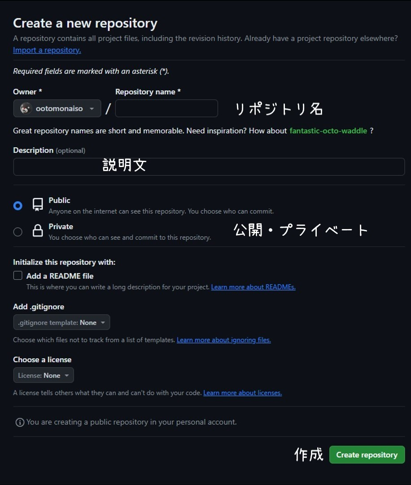
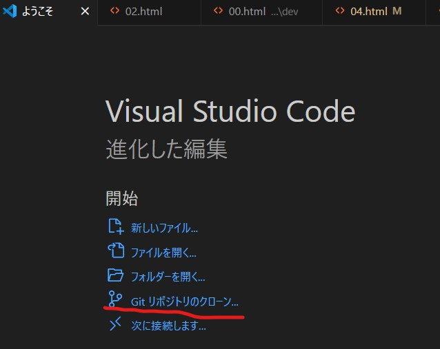
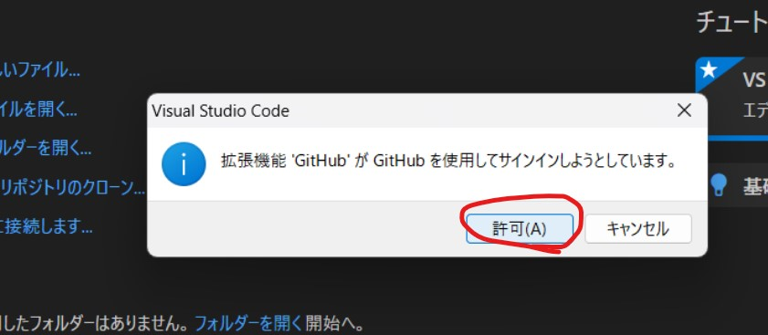

# Git、GitHubを使えるようになる

GitとGitHubはGoogleドライブのプログラム開発版みたいなものです。今回はGitHubにファイルをアップロードして、プロジェクトファイルのバックアップを取れるようになりましょう。Unityはデータの保存失敗→フリーズ→クラッシュの流れでデータが飛ぶことがまれにあります。これを防ぐために簡単な操作を覚えましょう。今回はVisual Studioの親戚であるVisual Studio Code、通称VSCodeを使って、Gitを使いGitHubにデータを上げれるようになりましょう。

## 1.Git Bashのインストーラーをダウンロードする
["Git Bashのダウンロードサイトはここ"](https://gitforwindows.org/)

上においたリンクからダウンロードサイトに飛びます。

そうしたら青いボタンにでっかくDownloadと書いてあるので押します。勝手にダウンロードされるのでこのインストーラーを開きます。

利用規約的な奴です。Nextを押しましょう

保存先はProgram FilesかCドライブを指定してください。

インストールするときに一緒にやってくれることを選択できます。今回はこのままで。デスクトップにアイコンが欲しい人はAdditional iconsにチェック入れればやってくれますよ。

スタートメニューフォルダの名前を決めれます。そのままNextをクリックしてください
しばらく特に変更しなくていいものが続くのでNextをひたすら押してください。
しばらく押し続けているとInstallが出てきますので、それを押してください。インストール完了したらFinishを押して完了です。

## 2.VSCodeをインストールする

["VScodeのダウンロードはここ"](https://code.visualstudio.com/download)

上のリンクからダウンロードサイトへ飛びます。

相変わらずインストーラーがダンロードフォルダにあるので開きます。このインストーラーはちゃんと日本語です。VSCodeをすでにすべてセットアップしていて再インストールするのが大変だったのでテキストのみ

利用許諾は同意するを選択し、次へをクリック
インストール先は
スタートメニューフォルダもそのまま次へ
デスクトップにアイコンを作成するにチェックを入れて次へ
インストールを押して終わり次第完了

# VSCodeを日本語にする

VSCodeを日本語化します。筆者の画面はもうすでに日本語になっていますが、やり方だけ紹介します。

左側のタイルマークをクリックして拡張機能の画面を開きます。
その画面の検索ボックスにJapanと入力し、赤丸でかこった言語パックを探してください。

インストールが終わるとVSCodeの右下にこの通知が来ます。青いボタンを押して、言語パックを適用させましょう

## Githubのアカウントをつくる

すでにGithubのアカウントを持っている人は飛ばしてください

[GitHubのHP](https://github.co.jp/)

上のサイトにアクセスしてください

自分のGoogleアカウントのアドレスを入力。終わったら右にあるボタンをクリック。同じようにパスワード、ユーザーネームを入力していく。メールの受信をするかどうかyとnで答えるやつはnを選択。結構メールが届きます。

アカウントの検証画面が開きます。ロボットではないことを証明する画像を選ぶやつです。

完了したらCreateAccountボタンをクリック

入力したメールアドレスにメールが届くので確認コードをコピーしてGithubのコード入力部分にペースト

プランが聞かれるのでFreeを選択

終了すると初期ページが開きます。これにて完了です。

## Gitにもメールアドレスとユーザーネームを登録する

gitのインストール先を開きます変えていなければProgram Files>Gitにあります。

設定ファイルの中身をいじくります。Gitファイルの中にあるetcファイルを開きます。その中にあるgitconfigをVSCodeなどのテキストエディタで開いてください

一番下の行を改行して下のテキストを入れてください

[user]  
    name = ユーザー名をここに入力  
    email = メールアドレス  

## GitHubでリモートリポジトリを作成する

GitHubのページにアクセスします

Create new repositoryという項目があるはずです。それをクリックします。

リポジトリ名はUnity_Projectなど、用途に合わせて決めてください。(要検討)日本語は使えません。
公開範囲はPublicを指定してください

上記の設定を確認したら右下にあるCreate repositoryを押してリポジトリを作成してください

## VSCode側で設定

VSCodeを開きます

ようこそ画面に出てくるGitリポジトリのクローンを選択します

画面上部にこのようなメニューが出てくるのでGitHubから複製を選択

初回使用時のみ、Github拡張機能の連携が必要です。許可を押してください。

そうするとブラウザ上で連携許可を出すページが出るので、右のAuthorize Visual Studio Codeをクリックし連携させてください。

初回起動時の設定を済ませると、どこにリポジトリを複製するかフォルダを選ぶエクスプローラーが開きます。Unity班であればここにUnityのプロジェクトを保存します。ファイルパスに日本語名が入るような場所は控えて、忘れそうな人はCドライブの直下にファイル作っとくと見つけやすいです。

ファイルを選択するとコピーが始まります